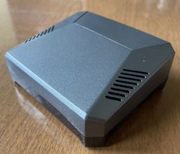

## Known Good and Tested Builds
___
### Argon build

| Device                                   | Link                                               | Notes               |
| ---------------------------------------- | -------------------------------------------------- | ------------------- |
| PC | [Raspberry Pi 4 8GB](https://www.amazon.com/Raspberry-Pi-Computer-Suitable-Workstation/dp/B0899VXM8F/) | 4GB should also be fine. 8GB if you want to run a lot of services. 
| Power | [CanaKit Power Supply - USB-C 3.5A](https://www.amazon.com/gp/product/B07TYQRXTK)                                       | None |
| SD Card Storage | [Samsung PRO Endurance 128GB](https://www.amazon.com/gp/product/B07B984HJ5)| Other storage sizes may be fine. Higher capcacity may mean longer life span thanks to wear-leveling.
| SSD Storage | [WD 1TB M.2 SSD](https://www.amazon.com/Blue-NAND-1TB-SSD-WDS100T2B0B/dp/B073SB2MXT)         | None |
| SSD Mounting/Case | [Argon ONE M.2 Aluminum Case](https://www.amazon.com/gp/product/B08MJ3CSW7)         | Includes a fan, but mine runs great with it unplugged. Fully passively cooled thanks to the aluminum case. (30°C ambient, 58°C actual)
| Display | NOT REQUIRED: Use the [cheapest display](https://www.amazon.com/s?k=Portable+HDMI+Monitor+7+Inch) you can find | No permanent display. This is a fully headless system, but a small HDMI monitor can be used for occasional debugging.
| Reliability | [🌛m00ninite🌛 Amboss Link](https://amboss.space/node/02c3ffc714b9ea194ec3f4fb46fa08bb0da1430584a60fb2177877fc7434af9b14)   | Online since October 2021 with no crashes. 
| Questions about this build? | | Contact @m00ninite in the raspiblitz Telegram chat 

___
### X825 build

| Device                                   | Link                                               | Notes               |
| ---------------------------------------- | -------------------------------------------------- | ------------------- |
| PC | [Raspberry Pi 4 8GB](https://www.amazon.com/Raspberry-Pi-Computer-Suitable-Workstation/dp/B0899VXM8F/)|
| Power | [5V 4A power supply with barrel connector](https://shop.pimoroni.com/products/raspberry-pi-build-hat-power-supply?variant=39484963553363) | Must be powered by the barrel connector, not USB-C
| SD Card Storage | [Samsung PRO Endurance 32GB](https://www.amazon.com/gp/product/B07B984HJ5) 
| SSD Storage | [Crucial MX500](https://www.amazon.com/Crucial-MX500-NAND-SATA-Internal/dp/B078211KBB/) (NOT BX500) 1TB SATA SSD | BX500 is [known](https://github.com/rootzoll/raspiblitz/issues/2599) to not work correctly.
| SSD Mounting | [X825 SSD expansion board](https://www.amazon.com/GeeekPi-Raspberry-Storage-Expansion-USB3-0/dp/B086GST5K6) |
| Case | [Raspiblitz Metal Case](https://shop.fulmo.org/product/raspiblitz-metal-case-case-only/)  | 
| Display | elegoo display 3.5 inch tft LCD | Included in raspiblitz metal case. Seems to be out of production, need a new LCD recommendation.
| Reliability | |  Seems there [could be](https://github.com/rootzoll/raspiblitz/issues/3138) occasional issues with the SSD disconnecting on older models of the X825 board.|
| Pre-built | [FULMO](https://shop.fulmo.org/product/raspiblitz-1-8-metalcase-edition/) | Don't want to source the parts yourself? This build can be bought pre-built from FULMO  

